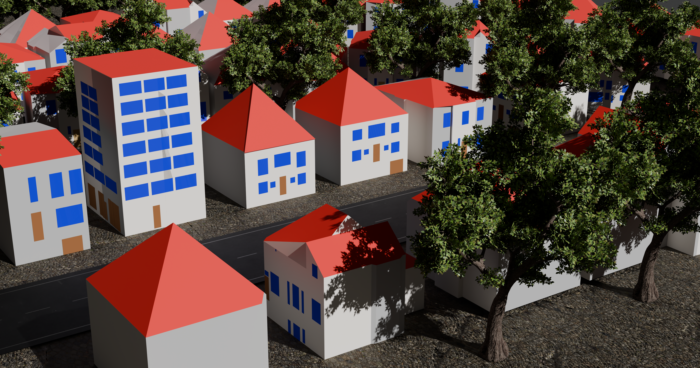
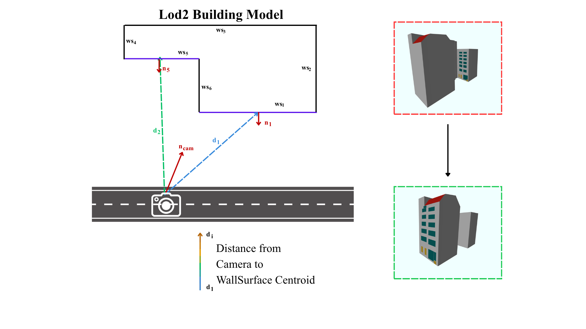

# Result Overview



# Project Setup

## 1. Required repository for validation

To validate the output LoD3.gml file clone the following repo:
```bash
git clone https://github.com/tudelft3d/CityGML-schema-validation.git
```

---

## 2. Create a virtual environment & install dependencies

```bash
pip install -r requirements.txt
```

## Notes

- If you are using the OpenAI integration, make sure to set your API key as an environment variable:

On macOS/Linux:
```bash
export OPENAI_API_KEY="your-api-key-here"
```

On Windows:
```bash
set OPENAI_API_KEY=your-api-key-here
```

## 3. Run the script

For one single Image:
```bash
python scripts/vlm_simple_cluster.py \
  --lod2 lod2.gml \
  --mask sam_mask.png \
  --rgb_image rgb_image.jpg \
  --choose_wall_py scripts/choose_wall_surface_from_camera_cluster.py \
  --compile_py scripts/compile_patch_to_citygml.py \
  --validator CityGML-schema-validation/valxsdcitygml.py \
  --llm_model "gpt-5.1" \
  --llm_api_key_env "OPENAI_API_KEY" \
  --out_dir Output_folder
```

if you are using any other LLM API service make sure to add the corresponding url:
```bash
  --llm_base_url "https://api.url" \
```

For an entire folder:
```bash
LOD2="lod2_folder"
OUT_DIR="Output_folder"
MASK_DIR="sam_mask_folder"
RGB_DIR="rgb_images_folder"

for rgb in "$RGB_DIR"/*.jpg; do
    base=$(basename "$rgb" .jpg)
    mask="$MASK_DIR/${base}_mask.png"
    lod="$LOD_DIR/${base}.gml"

    python scripts/vlm_simple_cluster.py \
        --lod2 "$lod" \
        --rgb_image "$rgb" \
        --mask_image "$mask" \
        --out_dir "$OUT_DIR" \
        --llm_model gpt-5.1 \
        --llm_api_key_env OPENAI_API_KEY \
        --choose_wall_py scripts/choose_wall_surface_from_camera_cluster.py \
        --validator CityGML-schema-validation/valxsdcitygml.py \
        --compile_py scripts/compile_patch_to_citygml_new.py
done
```
Make sure to name the images the same basename as the sam mask and lod2 model, as an example:
image: building.jpg
Sam_Mask: building_mask.png
lod2: building.gml

## 3. Run the evaluation

To run the evaluation make sure to structure you evaluation folder as follow:

Ground Truth: building_gt_mask.png
Sam_Mask: building_sam_mask.png
LLM Output: building_clean_mask.png

and run :
```bash
python frnds_iou.py
```

## WallSurface selection (updated)

`choose_wall_surface_from_camera_cluster.py` no longer picks the most frontal
wall. In dense urban scenes a farther WallSurface can have a better normal
alignment with the camera normal and get selected even when it is not the
facade visible in the photograph.

**Fix:** wall is selected using both the normal and the distance from the 
camera, the nearest one to the camera with is selected, discarding all walls that
not in visible distance to the camera.


This prevents a farther, coincidentally more head-on wall from overriding the
true camera-facing facade, a failure observed with perpendicular wall pairs 


